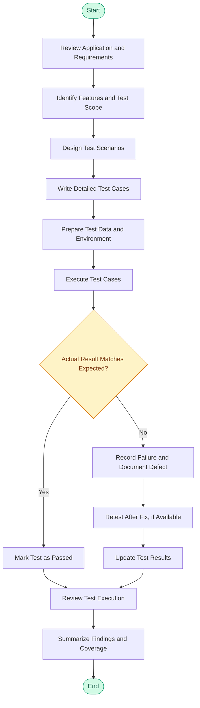

# Automation Exercise — Manual Testing Project

## 1. Project Overview

This repository documents a Software Quality Assurance (QA) project focused on testing the [Automation Exercise](https://automationexercise.com/) web application.

The project aims to evaluate the application's functionality, validate expected behavior across key user journeys, and identify and document potential defects through structured testing activities.

The testing scope includes Functional Testing, Regression Testing, Smoke Testing, Sanity Testing, and Negative Testing. The project demonstrates a systematic approach to test planning, test design, execution, and result documentation.

## 2. Project Objectives

- Validate core application features and user workflows against expected results.
- Design clear, structured, and reusable test scenarios and test cases.
- Identify and document deviations between actual and expected behavior.
- Verify that existing functionality remains stable following changes.
- Apply different testing techniques to assess application quality.
- Maintain organized testing documentation and execution evidence.

## 3. Application Under Test

**Application:** Automation Exercise  
**Website:** https://automationexercise.com/  
**Testing approach:** Manual Testing  
**Project domain:** E-commerce web application

The application provides user-facing e-commerce workflows, including account registration and login, product browsing, cart operations, and other shopping-related features.

## 4. Testing Scope

The project covers the following testing types:

| Testing Type | Purpose |
|---|---|
| Functional Testing | Verify that application features behave according to their expected functionality. |
| Regression Testing | Recheck existing functionality to identify unintended effects of changes. |
| Smoke Testing | Perform initial checks of critical application functionality. |
| Sanity Testing | Verify specific functionality after a focused change or fix. |
| Negative Testing | Validate how the application handles invalid inputs and unexpected user actions. |

### Key functional areas

- User registration and account creation
- Login and authentication
- Product browsing and search
- Product details and cart operations
- Subscription functionality
- Other relevant user workflows covered by the test cases


## 5. Testing Workflow

The following diagram illustrates the testing process from understanding requirements to reporting results.



### Workflow explanation

1. **Application and requirement review:** Understand the application, its functionality, and the user journeys to be tested.
2. **Scope identification:** Select the features and testing types relevant to the project.
3. **Test design:** Develop test scenarios and detailed test cases with preconditions, steps, and expected results.
4. **Test preparation:** Prepare the test environment and any required test data.
5. **Test execution:** Perform the documented steps and compare actual behavior with expected results.
6. **Defect documentation:** Record failed tests and the observed behavior. Where applicable, retest after a fix.
7. **Result analysis:** Review execution outcomes and summarize test coverage and findings.

## 6. Test Design and Execution

Test cases should be organized to make the testing process understandable, repeatable, and traceable.

Each detailed test case should include, where applicable:

- Test Case ID
- Test Scenario
- Preconditions
- Test Steps
- Test Data
- Expected Result
- Actual Result
- Execution Status
- Comments or Defect Reference

**Execution status:**  
- **Pass:** Actual result matches the expected result.
- **Fail:** Actual result differs from the expected result.
- **Blocked:** Execution cannot proceed because of an unresolved dependency or issue.
- **Not Executed:** The test has not yet been performed.

## 7. Repository Structure

The repository includes project documentation and configuration files. The current top-level files include:

```text
automation-exercise-manual-testing/
│
├── README.md
├── .gitignore
├── pom.xml
│
├── master.xml
├── Test_groups.xml
│
├── suite_1.xml
├── suite_2.xml
├── suite_3.xml
├── suite_4.xml
├── suite_5.xml
├── suite_6.xml
├── suite_7.xml
├── suite_8.xml
└── suite_9.xml
```

### Configuration files

| File | Purpose |
|---|---|
| README.md | Project overview, testing documentation, and instructions. |
| .gitignore | Specifies files and folders that should not be tracked by Git. |
| pom.xml | Maven project configuration and dependency management. |
| master.xml | Main TestNG suite configuration, if used as the suite entry point. |
| Test_groups.xml | TestNG group configuration, if used. |
| suite_1.xml – suite_9.xml | Individual TestNG suite configurations, if used. |


## 8. Tools and Technologies

- **Manual Testing:** Test design and execution.
- **Web Browser:** Application access and validation.
- **Git and GitHub:** Version control and project documentation.
- **Maven and TestNG:** Included configuration files, if they are used for associated automated tests.

## 9. Deliverables and Results

The project documentation should provide a clear record of the testing work completed.

Potential deliverables include:

- Test scenarios and detailed test cases.
- Test execution results.
- Defect reports, where defects were identified.
- Screenshots or other test evidence.
- A summary of tested functionality and observed findings.

**Execution summary**

| Metric | Result |
|---|---|
| Total test cases | [Enter actual count] |
| Executed | [Enter actual count] |
| Passed | [Enter actual count] |
| Failed | [Enter actual count] |
| Blocked | [Enter actual count] |
| Not executed | [Enter actual count] |

## 10. Author

**Hassnaa Ibrahim**  
Software Testing | Quality Assurance

GitHub: [https://github.com/Hassnaa24]
